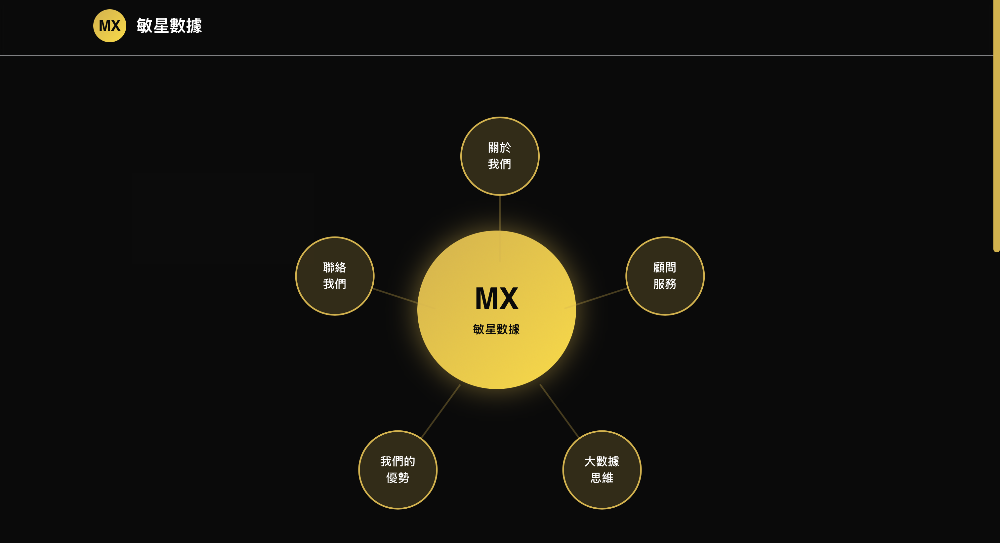

# MX-STAR 官網

本專案為官方網站，採用 Next.js 架構，已部署至 [Vercel](https://mx-star-website.vercel.app) (點即可查看)。


## 本地啟動

```bash
npm install
npm run dev
```

啟動後請開啟瀏覽器前往 [http://localhost:3000](http://localhost:3000) 查看畫面。

你可以透過修改 `app/page.tsx` 來開始編輯頁面，儲存後會自動更新。


## .gitignore 範例

為避免將不必要的檔案納入版本控制，建議在專案根目錄新增 `.gitignore`

```gitignore
# dependencies
/node_modules
/.pnp
.pnp.*
.yarn/*
!.yarn/patches
!.yarn/plugins
!.yarn/releases
!.yarn/versions

# testing
/coverage

# next.js
/.next/
/out/

# production
/build

# misc
.DS_Store
*.pem

# debug
npm-debug.log*
yarn-debug.log*
yarn-error.log*
.pnpm-debug.log*

# env files (can opt-in for committing if needed)
.env*

# vercel
.vercel

# typescript
*.tsbuildinfo
next-env.d.ts

```

